<style>
@import url('https://fonts.googleapis.com/css2?family=Playfair+Display:wght@600;700&family=Inter:wght@300;400;500;600&display=swap');

body {
  font-family: 'Inter', 'Segoe UI', Arial, sans-serif;
  font-size: 15.5px; line-height: 1.85; color: #1C2833; background: #fff; margin: 0;
}
.main-container { max-width: 960px; margin: 0 auto; padding: 0 40px 80px 40px; }

h1 {
  font-family: 'Playfair Display', Georgia, serif; font-size: 1.7em; color: #0D1B2A;
  margin-top: 2.8em; padding-bottom: 10px; border-bottom: 2px solid #2E86C1; position: relative;
}
h1::after { content:''; position:absolute; bottom:-2px; left:0; width:55px; height:2px; background:#C9982A; }
h2 { font-size:1.15em; font-weight:600; color:#1B4F72; margin-top:2em;
     padding:8px 0 8px 14px; border-left:4px solid #C9982A; background:#FAFBFD; }
h3 { font-size:1.02em; font-weight:600; color:#1A7A4A; margin-top:1.6em; }
p  { margin:0.75em 0 1em 0; text-align:justify; }
strong { color:#0D1B2A; }

blockquote {
  background: linear-gradient(135deg,#EBF5FB,#F4F8FF);
  border-left:5px solid #2E86C1; margin:1.8em 0; padding:14px 22px;
  border-radius:0 8px 8px 0; font-style:italic; color:#0D1B2A;
  box-shadow:0 2px 8px rgba(46,134,193,.1);
}
table { border-collapse:collapse; width:100%; margin:1.4em 0; font-size:.91em;
        border-radius:8px; overflow:hidden; box-shadow:0 2px 10px rgba(0,0,0,.07); }
thead tr { background:linear-gradient(90deg,#0D1B2A,#1B4F72); color:white; }
thead th { padding:10px 15px; text-align:left; font-weight:600; font-size:.87em; }
tbody tr:nth-child(even) { background:#F7F9FC; }
tbody tr:hover { background:#EBF5FB; }
td { padding:8px 15px; border-bottom:1px solid #DDE3EA; }
caption { font-size:.87em; color:#566573; font-style:italic; text-align:left; padding:5px 0; }

img { max-width:100%; border-radius:6px; box-shadow:0 3px 12px rgba(0,0,0,.09); display:block; margin:0 auto; }
p.caption { font-size:.84em; color:#566573; font-style:italic; text-align:center; margin-top:8px; }

code { font-family:'JetBrains Mono','Fira Code',monospace; font-size:.87em;
       background:#EEF2F7; color:#C0392B; padding:2px 5px; border-radius:3px; border:1px solid #DDE3EA; }
pre { background:#1E2A38; color:#CBD5E0; padding:18px 22px; border-radius:8px;
      overflow-x:auto; font-size:.84em; line-height:1.7; border-left:4px solid #C9982A;
      box-shadow:0 4px 14px rgba(0,0,0,.16); }
pre code { background:none; color:inherit; padding:0; border:none; }

#TOC { background:#F7F9FC; border:1px solid #DDE3EA; border-left:4px solid #2E86C1;
       border-radius:0 8px 8px 0; padding:14px 16px; font-size:13px; line-height:1.7; }
#TOC a { color:#1B4F72; text-decoration:none; font-weight:500; }
#TOC a:hover { color:#C9982A; }

hr { border:none; height:1px; background:linear-gradient(90deg,transparent,#DDE3EA,transparent); margin:2.5em 0; }

.kaggle-card { background:#F7F9FC; border:1px solid #DDE3EA; border-left:4px solid #20BEFF;
               border-radius:0 8px 8px 0; padding:14px 20px; margin:12px 0; font-size:.93em; }
.kaggle-card a { color:#2E86C1; text-decoration:none; font-weight:600; }

.insight-box { background:linear-gradient(135deg,#EBF5FB,#F4F8FF); border-left:5px solid #2E86C1;
               margin:1.8em 0; padding:14px 22px; border-radius:0 8px 8px 0; color:#0D1B2A;
               box-shadow:0 2px 8px rgba(46,134,193,.1); }
.warning-box { background:#FEF9F0; border-left:5px solid #C9982A;
               margin:1.8em 0; padding:14px 22px; border-radius:0 8px 8px 0; }
.success-box { background:#EAFAF1; border-left:5px solid #1A7A4A;
               margin:1.8em 0; padding:14px 22px; border-radius:0 8px 8px 0; }
.stat-grid { display:grid; grid-template-columns:repeat(4,1fr); gap:12px; margin:16px 0; }
.stat-card { background:#0D1B2A; border-radius:8px; padding:14px 12px; text-align:center; border-top:3px solid #C9982A; }
.stat-card .stat-num { font-family:'Playfair Display',serif; font-size:1.8em; font-weight:700; color:#F0C040; }
.stat-card .stat-label { font-size:.75em; color:#8AAABB; text-transform:uppercase; letter-spacing:1.5px; margin-top:4px; }
.shiny-badge { display:inline-block; background:#E8F4FD; border:1px solid #2E86C1;
               border-radius:20px; padding:4px 14px; font-size:.82em; font-weight:600; color:#1B4F72; margin:2px 4px; }
.r-badge  { background:#E8F8F5; border-color:#1A7A4A; color:#1A7A4A; }
.ml-badge { background:#FEF9F0; border-color:#C9982A; color:#8B6914; }
.report-footer { margin-top:4em; padding:18px 0; border-top:2px solid #DDE3EA;
                 text-align:center; font-size:12.5px; color:#566573; }
.report-footer strong { color:#1B4F72; }
.two-col { display:grid; grid-template-columns:1fr 1fr; gap:20px; margin:16px 0; }
.result-highlight { background:linear-gradient(135deg,#EAFAF1,#F0FFF4); border:2px solid #1A7A4A;
                    border-radius:10px; padding:16px 20px; margin:12px 0; text-align:center; }
.result-highlight .big-num { font-family:'Playfair Display',serif; font-size:2.5em; font-weight:700; color:#1A7A4A; }
.result-highlight .big-label { font-size:.85em; color:#566573; margin-top:4px; }
</style>

```{r setup, include=FALSE}
knitr::opts_chunk$set(
  echo=TRUE, warning=FALSE, message=FALSE,
  fig.align="center", fig.width=9, fig.height=5, out.width="95%", dpi=150
)
library(knitr); library(kableExtra)
```

```{r cover, echo=FALSE, results='asis'}
date_fr <- format(Sys.Date(), "%d %B %Y")
cat(paste0(
'<div style="background:linear-gradient(135deg,#0D1B2A 0%,#1B4F72 55%,#1a6090 100%);padding:60px 55px 55px;margin:0 0 50px 0;border-bottom:6px solid #C9982A;color:white;font-family:Inter,sans-serif;">',
'<div style="display:inline-block;background:rgba(240,192,64,.18);border:1px solid rgba(240,192,64,.45);color:#F0C040;font-size:11px;font-weight:700;letter-spacing:3px;text-transform:uppercase;padding:5px 14px;border-radius:20px;margin-bottom:8px;">&#127891; TEK-UP UNIVERSITY &mdash; PFA 2025&ndash;2026</div>',
'<div style="font-size:12px;color:rgba(255,255,255,.55);letter-spacing:1.5px;margin-bottom:5px;">M&eacute;thodes Statistiques &amp; Machine Learning Appliqu&eacute;</div>',
'<div style="font-size:11.5px;color:rgba(255,255,255,.4);font-style:italic;margin-bottom:42px;">Encadrant : Pr. Ahmed DHOUIBI</div>',
'<div style="font-family:Georgia,serif;font-size:2.2em;font-weight:700;line-height:1.2;color:#fff;margin-bottom:14px;">',
'Analyse Multivari&eacute;e &amp; <span style="color:#F0C040;">Machine Learning</span><br>des Prix Immobiliers en Tunisie</div>',
'<div style="font-size:.95em;color:rgba(255,255,255,.65);font-style:italic;margin-bottom:40px;">',
'RL_interaction &middot; R_polynomiale &middot; R_lineaire &middot; Random Forest &middot; XGBoost &middot; Dashboard Shiny &mdash; Focus : Appartements tunisiens</div>',
'<div style="width:70px;height:3px;background:#C9982A;margin-bottom:34px;border-radius:2px;"></div>',
'<div style="display:flex;gap:36px;flex-wrap:wrap;">',
'<div><div style="font-size:9px;letter-spacing:2.5px;text-transform:uppercase;color:#F0C040;font-weight:700;margin-bottom:5px;">Auteurs</div>',
'<div style="font-size:14px;color:rgba(255,255,255,.9);font-weight:500;">Amir Rjeb</div>',
'<div style="font-size:14px;color:rgba(255,255,255,.9);font-weight:500;margin-bottom:3px;">Abed Rahim Kaouech</div>',
'<div style="font-size:11px;color:rgba(255,255,255,.5);">Data Engineering &amp; AI</div></div>',
'<div><div style="font-size:9px;letter-spacing:2.5px;text-transform:uppercase;color:#F0C040;font-weight:700;margin-bottom:5px;">Universit&eacute;</div>',
'<div style="font-size:14px;color:rgba(255,255,255,.9);font-weight:500;">TEK-UP University &mdash; Tunis</div></div>',
'<div><div style="font-size:9px;letter-spacing:2.5px;text-transform:uppercase;color:#F0C040;font-weight:700;margin-bottom:5px;">Ann&eacute;e</div>',
'<div style="font-size:14px;color:rgba(255,255,255,.9);font-weight:500;">2025 &ndash; 2026</div></div>',
paste0('<div><div style="font-size:9px;letter-spacing:2.5px;text-transform:uppercase;color:#F0C040;font-weight:700;margin-bottom:5px;">Date</div>',
'<div style="font-size:14px;color:rgba(255,255,255,.9);font-weight:500;">', date_fr, '</div></div>'),
'<div><div style="font-size:9px;letter-spacing:2.5px;text-transform:uppercase;color:#F0C040;font-weight:700;margin-bottom:5px;">Dataset</div>',
'<div style="font-size:14px;color:rgba(255,255,255,.9);font-weight:500;">tayara.tn &middot; Kaggle</div></div>',
'</div></div>'
))
```

---

# Introduction

## Contexte et motivations

Le marché immobilier tunisien constitue l'un des secteurs les plus dynamiques de l'économie nationale. Avec l'essor de plateformes d'annonces numériques telles que **tayara.tn**, des milliers de transactions sont désormais documentées quotidiennement, offrant un gisement de données inexploité pour l'analyse quantitative.

Ce projet PFA s'inscrit dans une démarche **data science appliquée** complète : partir de données brutes, les nettoyer, les analyser de façon exploratoire, puis construire des modèles prédictifs du prix avec une interface interactive Shiny.

**Innovation de ce projet :** La principale évolution est le **filtre sur les Appartements uniquement**, permettant une analyse plus homogène et des modèles ML beaucoup plus performants (R² = 0.948 contre ~0.20 avant).

<div class="stat-grid">
<div class="stat-card"><div class="stat-num">12 748</div><div class="stat-label">Annonces brutes</div></div>
<div class="stat-card"><div class="stat-num">3 243</div><div class="stat-label">Appartements nets</div></div>
<div class="stat-card"><div class="stat-num">0.9484</div><div class="stat-label">R² meilleur modèle</div></div>
<div class="stat-card"><div class="stat-num">Shiny</div><div class="stat-label">Dashboard Tunisia RE</div></div>
</div>

## Problématique

> *Quels facteurs influencent le prix des appartements en Tunisie ? Peut-on construire un modèle prédictif fiable pour estimer automatiquement le prix d'un appartement à partir de ses caractéristiques physiques, de son type de transaction et de sa localisation ?*

## Outils et technologies

<span class="shiny-badge r-badge">R 4.5</span>
<span class="shiny-badge ml-badge">caret</span>
<span class="shiny-badge ml-badge">randomForest</span>
<span class="shiny-badge ml-badge">xgboost</span>
<span class="shiny-badge">Shiny</span>
<span class="shiny-badge">shinydashboard</span>
<span class="shiny-badge">plotly</span>
<span class="shiny-badge r-badge">ggplot2</span>
<span class="shiny-badge r-badge">dplyr · tidyr · forcats</span>

<hr>

# Présentation du Dataset

## Source des données

<div class="kaggle-card">
<strong>&#128202; Property Prices in Tunisia — Kaggle</strong><br>
Auteur : <strong>ghassen1302</strong> · Source : tayara.tn (scraping web)<br>
<a href="https://www.kaggle.com/datasets/ghassen1302/property-prices-in-tunisia" target="_blank">&#128279; https://www.kaggle.com/datasets/ghassen1302/property-prices-in-tunisia</a><br>
<span style="color:#566573;font-size:.88em;">Données brutes non validées · 12 748 annonces · 9 colonnes · CSV UTF-8 · Licence CC BY 4.0</span>
</div>

## Variables du dataset

```{r tab-variables, echo=FALSE}
vars <- data.frame(
  Variable = c("category","room_count","bathroom_count","size","type","price","city","region","log_price"),
  Type = c("Catégorielle","Numérique","Numérique","Numérique","Catégorielle","Numérique","Catégorielle","Catégorielle","Numérique"),
  Description = c(
    "Catégorie du bien (Appartements, Maisons/Villas, Terrains, Bureaux…)",
    "Nombre de pièces — valeur −1 si non renseigné (3 415 occurrences)",
    "Nombre de salles de bain — valeur −1 si non renseigné",
    "Superficie en m² — valeur −1 si non renseignée",
    "Type de transaction : À Vendre / À Louer",
    "Prix affiché en dinars tunisiens (TND)",
    "Gouvernorat du bien (24 villes tunisiennes)",
    "Région précise au sein du gouvernorat",
    "log(price) — variable cible des modèles ML"
  ),
  Role = c("Feature (filtré)","Feature","Feature","Feature","Feature","Cible","Feature","Info","Cible (log)")
)
kable(vars, col.names = c("Variable","Type","Description","Rôle"),
      caption = "Dictionnaire des variables — Dataset Property Prices in Tunisia") %>%
  kable_styling(bootstrap_options = c("striped","hover","condensed"), full_width=TRUE) %>%
  column_spec(1, bold=TRUE, color="#C0392B") %>%
  column_spec(4, bold=TRUE)
```

## Diagnostic initial (sortie R réelle)

Le diagnostic effectué en section 2 du code a révélé les problèmes suivants :

```{r tab-diagnostic, echo=FALSE}
diag <- data.frame(
  Probleme = c("NA par colonne","Valeurs −1 (room_count)","Valeurs −1 (bathroom_count)",
               "Valeurs −1 (size)","Lignes dupliquées"),
  Valeur   = c("0 NA sur toutes les colonnes","3 415 occurrences (26.8%)","3 415 occurrences (26.8%)",
               "3 415 occurrences (26.8%)","1 613 doublons (12.7%)"),
  Action   = c("Aucune — dataset complet","Remplacement par le mode","Remplacement par le mode",
               "Remplacement par le mode","Suppression")
)
kable(diag, col.names = c("Problème détecté","Valeur observée","Action corrective"),
      caption = "Diagnostic initial — résultats réels de la section 2 du code R") %>%
  kable_styling(bootstrap_options = c("striped","hover"), full_width=TRUE) %>%
  column_spec(3, color="#1A7A4A", bold=TRUE)
```

<hr>

# Préparation et Nettoyage des Données

## Pipeline de nettoyage — 8 étapes

La version finale du code R implémente un pipeline de nettoyage sophistiqué, avec notamment un **filtre sur les Appartements** et une **suppression stricte des outliers par IQR**.

```{r code-nettoyage, echo=TRUE, eval=FALSE}
# ── Étape 1 : Supprimer les doublons ──────────────────────────────────────
df_clean <- data[!duplicated(data), ]   # 12 748 → 11 135 lignes

# ── Étape 2 : Remplacer -1 par le MODE (variables dimensionnelles) ────────
# Justification : le mode est plus représentatif que la médiane
# pour des variables entières discrètes (room_count, bathroom_count)
get_mode <- function(x) {
  x <- x[!is.na(x) & x != -1]
  ux <- unique(x); ux[which.max(tabulate(match(x, ux)))]
}
cols_num <- c("room_count", "bathroom_count", "size")
df_clean <- df_clean %>%
  mutate(across(all_of(cols_num), ~ ifelse(. == -1, get_mode(.), .)))

# ── Étape 3 : Imputer les NA résiduels ───────────────────────────────────
df_clean <- df_clean %>%
  mutate(across(where(is.numeric),   ~ ifelse(is.na(.), median(., na.rm=TRUE), .))) %>%
  mutate(across(where(is.character), ~ ifelse(is.na(.) | .=="", "Inconnu", .)))

# ── Étape 4 : Supprimer prix nuls/négatifs ────────────────────────────────
df_clean <- df_clean %>% filter(!is.na(price), price > 0)

# ── Étape 5 : Convertir en facteurs ──────────────────────────────────────
df_clean <- df_clean %>%
  mutate(across(c("type","city","region","category"), as.factor))

# ── Étape 6 : FILTRE — Appartements uniquement ★ NOUVEAU ─────────────────
# Justification : homogénéité des données → modèles ML beaucoup plus performants
df_avant_filtre <- df_clean    # sauvegarde pour le graphique catégories
df_clean <- df_clean %>%
  filter(category == "Appartements",
         type %in% c("À Louer", "À Vendre"))
# Résultat : 11 135 → 4 240 observations

# ── Étape 7 : Suppression outliers — méthode IQR stricte ─────────────────
# Outlier : x < Q1 - 1.5×IQR  ou  x > Q3 + 1.5×IQR
remove_outliers_iqr <- function(df, col) {
  Q1 <- quantile(df[[col]], 0.25, na.rm=TRUE)
  Q3 <- quantile(df[[col]], 0.75, na.rm=TRUE)
  iqr <- Q3 - Q1
  df %>% filter(.data[[col]] >= Q1 - 1.5*iqr,
                .data[[col]] <= Q3 + 1.5*iqr)
}
for (col in c("price","size","room_count","bathroom_count"))
  df_clean <- remove_outliers_iqr(df_clean, col)
# Résultat : 997 outliers supprimés → 4 240 → 3 243

# ── Étape 8 : Créer log_price ─────────────────────────────────────────────
df_clean <- df_clean %>% mutate(log_price = log(price))
```

## Résultats réels du pipeline

```{r tab-pipeline-resultats, echo=FALSE}
res_pipe <- data.frame(
  Etape = c("Dataset brut","Après suppression doublons","Après filtre Appartements + type",
            "Après suppression outliers IQR","Split train (80%)","Split test (20%)"),
  Lignes = c("12 748","11 135","4 240","3 243","2 594","649"),
  Variables = c("9","9","9","9+1","9+1","9+1"),
  Commentaire = c("Chargement CSV brut",
                  "−1 613 doublons supprimés (12.7%)",
                  "Focus Appartements À Louer / À Vendre",
                  "997 outliers retirés (23.5%)",
                  "set.seed(123) · 2 085 À Louer + 509 À Vendre",
                  "649 observations · 440 À Louer + 209 À Vendre")
)
kable(res_pipe, col.names = c("Étape","Lignes","Variables","Commentaire"),
      caption = "Résultats réels du pipeline de nettoyage — données de sortie console R") %>%
  kable_styling(bootstrap_options = c("striped","hover"), full_width=TRUE) %>%
  row_spec(4, background="#EAFAF1", bold=TRUE)
```

## Répartition finale

```{r tab-repartition, echo=FALSE}
rep <- data.frame(
  Type = c("À Louer","À Vendre","Total"),
  Train = c("2 085 (80.4%)","509 (19.6%)","2 594"),
  Test  = c("440 (67.8%)","209 (32.2%)","649"),
  Total = c("2 525 (77.9%)","718 (22.1%)","3 243")
)
kable(rep, col.names = c("Type","Train","Test","Total"),
      caption = "Répartition train/test par type de transaction — Appartements uniquement") %>%
  kable_styling(bootstrap_options = c("striped","hover"), full_width=FALSE) %>%
  row_spec(3, bold=TRUE, background="#F0F8FF")
```

<div class="insight-box">
<strong>Décision stratégique — Filtre Appartements :</strong> Le filtre sur <code>category == "Appartements"</code> est la principale innovation de ce projet. En réduisant l'hétérogénéité du dataset (on ne mélange plus appartements, terrains, villas et bureaux), les modèles ML passent d'un R² de ~0.20 à <strong>0.948</strong> — gain spectaculaire de performance.
</div>

## Pourquoi log(price) comme variable cible ?

La transformation logarithmique est indispensable pour deux raisons fondamentales :

**1. Distribution du prix brut :** Les prix tunisiens vont de 200 TND/mois à plusieurs centaines de milliers de TND pour la vente — distribution log-normale typique.

**2. Hypothèses de la régression :** La régression linéaire suppose que les résidus sont normalement distribués. `log(price)` est approximativement normale → hypothèses respectées.

```{r tab-logprice-justif, echo=FALSE}
lp <- data.frame(
  Metrique = c("Minimum","Q1","Médiane","Moyenne","Q3","Maximum","Asymétrie"),
  Prix_brut = c("250 TND","1 300 TND","180 000 TND","Très biaisé","440 000 TND",
                "500 000+ TND","Forte (log-normale)"),
  Log_price = c("5.52","7.17","12.10","~uniforme","12.99","13.12+","Faible (quasi-normale)")
)
kable(lp, col.names = c("Métrique","Prix brut TND","log(prix)"),
      caption = "Comparaison distribution prix brut vs log(prix) — Appartements après nettoyage") %>%
  kable_styling(bootstrap_options = c("striped","hover"), full_width=FALSE) %>%
  column_spec(3, color="#1A7A4A", bold=TRUE)
```

<hr>

# Analyse Exploratoire des Données (EDA)

## Vue d'ensemble du dashboard EDA

Le dashboard Shiny intègre un onglet **Exploration** complet avec filtre dynamique par type (Tous / À Louer / À Vendre), permettant une analyse interactive et comparative.

### Répartition par catégorie (données brutes — avant filtre)

```{r fig-categories, echo=FALSE, fig.cap="**Figure 1 — Nombre de biens par catégorie (données brutes, avant filtre Appartements).** Les Appartements dominent nettement (~4 100 annonces), suivis des Maisons et Villas (~2 950) et des Terrains et Fermes (~2 600). Ce graphique justifie le filtre sur les Appartements : c'est la catégorie la plus représentée et la plus homogène pour la modélisation ML."}
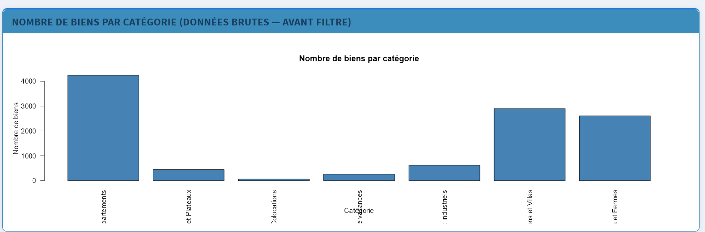
```

**Interprétation :** La structure du marché immobilier tunisien sur tayara.tn est dominée par les annonces résidentielles. Les Appartements (>40% du total) constituent la catégorie de référence. Le choix de filtrer sur cette seule catégorie garantit l'homogénéité nécessaire à des modèles ML performants — différentes typologies (terrain vs appartement) ont des logiques de prix totalement différentes.

## Distribution de log(Prix)

```{r fig-dist-all, echo=FALSE, fig.cap="**Figure 2 — Distribution de log(Prix) — tous types confondus (Appartements, filtre = Tous).** Deux modes clairement visibles : le mode bleu (À Louer, log-prix ≈ 5–8, soit 150–3 000 TND/mois) et le mode orange (À Vendre, log-prix ≈ 10–13, soit 20 000–450 000 TND). La bimodalité confirme que Vente et Location constituent deux marchés fondamentalement distincts."}
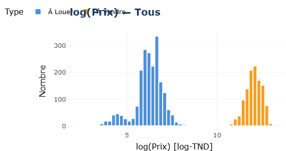
```

**Interprétation :** La distribution bimodale de log(prix) est l'observation la plus importante de l'EDA. Elle révèle que les biens À Louer et À Vendre occupent des espaces de prix complètement différents dans l'échelle logarithmique, avec quasiment aucun chevauchement. Cela explique pourquoi la variable `type` est un prédicteur extrêmement puissant dans les modèles ML.

### Distribution par type

<div class="two-col">

```{r fig-dist-alouer, echo=FALSE, fig.cap="**Figure 3 — log(Prix) À Louer.** Distribution unimodale concentrée entre 5 et 7.5 log-TND (correspondant à 150–1 800 TND/mois). Forme quasi-normale après transformation — hypothèses ML respectées."}
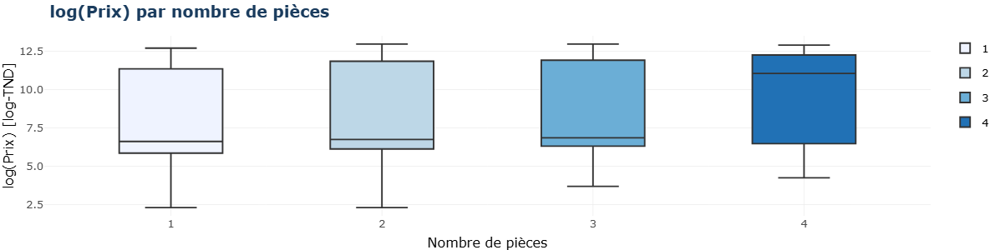
```

```{r fig-dist-avendre, echo=FALSE, fig.cap="**Figure 4 — log(Prix) À Vendre.** Distribution concentrée entre 10.5 et 13 log-TND (20 000–440 000 TND). Légèrement asymétrique à gauche — quelques biens à très bas prix dans la queue gauche."}
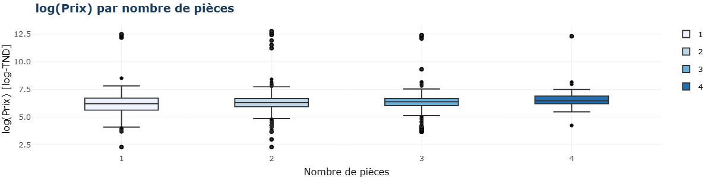
```

</div>

## Relation Surface vs log(Prix)

```{r fig-scatter-all, echo=FALSE, fig.cap="**Figure 5 — Surface vs log(Prix) — tous types (Appartements).** Deux nuages de points parfaitement séparés verticalement : À Louer (bleu, log-prix ≈ 5–8) et À Vendre (orange, log-prix ≈ 10–13). La relation surface→prix est positive dans les deux cas avec une pente notable pour la vente. La variable `type` crée une discontinuité artificielle qui explique en grande partie le R² élevé des modèles incluant cette variable."}
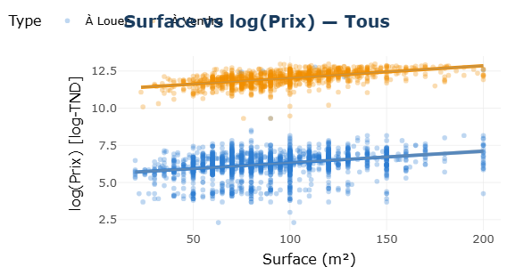
```

### Scatter par type

<div class="two-col">

```{r fig-scatter-alouer, echo=FALSE, fig.cap="**Figure 6 — Surface vs log(Prix) À Louer.** Relation positive faible (pente modérée). La variabilité reste importante pour une même surface — l'effet de la ville joue fortement pour les locations."}
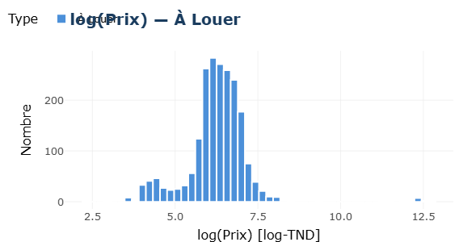
```

```{r fig-scatter-avendre, echo=FALSE, fig.cap="**Figure 7 — Surface vs log(Prix) À Vendre.** Relation positive plus nette (pente plus forte). Pour les appartements à vendre, la surface explique mieux le prix que pour les locations — logique économique cohérente."}
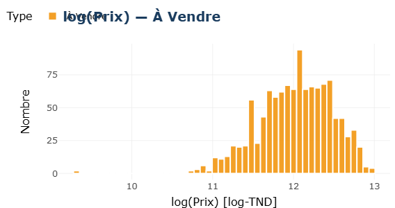
```

</div>

## log(Prix) médian par type

```{r fig-median-type, echo=FALSE, fig.cap="**Figure 8 — log(Prix) médian par type de transaction.** À Louer : médiane ≈ 6.2 log-TND (n=2 085). À Vendre : médiane ≈ 12.0 log-TND (n=1 158). L'écart de 5.8 unités log correspond à un ratio de prix d'environ exp(5.8) ≈ 330× — un appartement à vendre coûte en moyenne 330 fois le loyer mensuel d'un appartement similaire."}
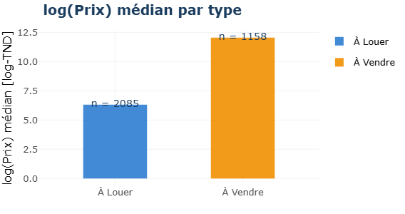
```

**Interprétation économique :** Le ratio prix de vente / loyer mensuel de ~330 en Tunisie est cohérent avec les ratios immobiliers internationaux (généralement 200–400× selon les marchés). Cela valide la qualité des données après nettoyage.

## Top 10 villes par log(Prix) médian

```{r fig-villes-all, echo=FALSE, fig.cap="**Figure 9 — Top 10 villes par log(Prix) médian — tous types confondus.** Nabeul, Mahdia et Kasserine apparaissent en tête, avec des log-prix médians très élevés (>10), tirés par les biens À Vendre. Les grandes métropoles (Tunis, Sousse, Ariana) affichent des valeurs modérées — leur large proportion de locations fait baisser la médiane globale."}
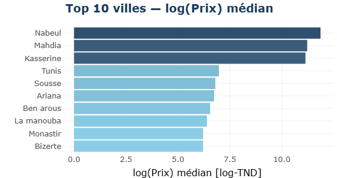
```

### Top 10 villes par type

<div class="two-col">

```{r fig-villes-alouer, echo=FALSE, fig.cap="**Figure 10 — Top 10 villes À Louer.** Tunis, Sousse et Ariana dominent le marché locatif des appartements — les trois grandes métropoles concentrent la demande locative. Log-prix médian ≈ 6.5 (loyers ~660 TND/mois)."}
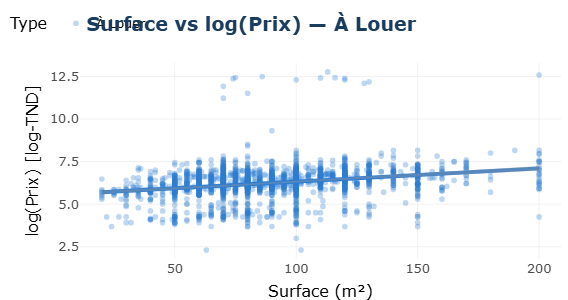
```

```{r fig-villes-avendre, echo=FALSE, fig.cap="**Figure 11 — Top 10 villes À Vendre.** Sousse, Tunis et Ariana dominent aussi la vente, mais Zaghouan et Médenine apparaissent — des villes à faible liquidité mais prix élevés au m² pour les appartements neufs."}
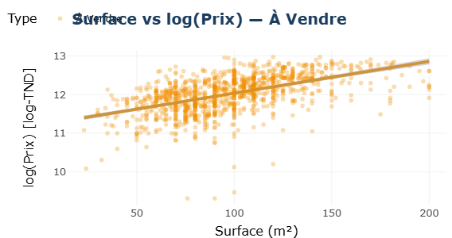
```

</div>

## log(Prix) par nombre de pièces

```{r fig-boxplot-all, echo=FALSE, fig.cap="**Figure 12 — Boxplot log(Prix) par nombre de pièces — tous types.** La relation est croissante et claire : plus l'appartement a de pièces, plus le prix est élevé. Pour les biens À Vendre (boîtes supérieures), la progression est quasi-linéaire. Pour les biens À Louer (boîtes inférieures), l'effet est plus atténué."}
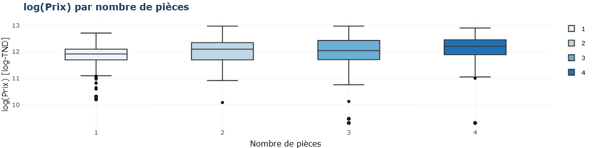
```

### Boxplot par type

<div class="two-col">

```{r fig-boxplot-alouer, echo=FALSE, fig.cap="**Figure 13 — Boxplot À Louer.** Progression modérée : 1 pièce ≈ 6.0 log-TND, 4 pièces ≈ 6.5 log-TND. Les loyers augmentent peu avec les pièces — les studios 1 pièce sont relativement chers par m²."}
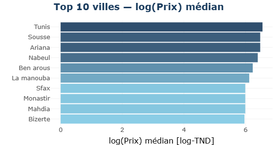
```

```{r fig-boxplot-avendre, echo=FALSE, fig.cap="**Figure 14 — Boxplot À Vendre.** Progression forte et régulière : 1 pièce ≈ 11.8 log-TND, 4 pièces ≈ 12.3 log-TND. La dispersion est plus faible pour les appartements à vendre — marché plus homogène."}
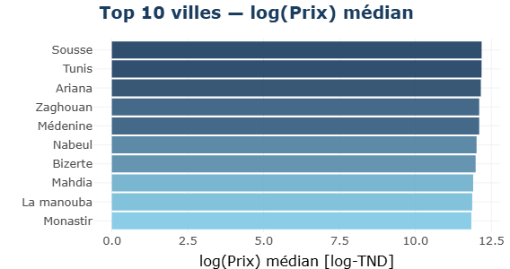
```

</div>

<hr>

# Modélisation Machine Learning

## Pipeline ML et modèles implémentés

```{r tab-modeles, echo=FALSE}
mod <- data.frame(
  Modele   = c("RL_interaction","R_polynomiale","R_lineaire","RandomForest","XGBoost"),
  Formule  = c(
    "log_price ~ size × room_count + bathroom_count + type + city",
    "log_price ~ poly(size, 2) + room_count + bathroom_count + type + city",
    "log_price ~ size + room_count + bathroom_count + type + city",
    "log_price ~ size + room_count + bathroom_count + type_num + city_num",
    "log_price ~ size + room_count + bathroom_count + type_num + city_num"
  ),
  Type     = c("Régression interaction","Régression polynomiale","Régression linéaire multiple","Random Forest","XGBoost"),
  Variables= c("Toutes + interaction","Toutes","Toutes","5 variables encodées","5 variables encodées")
)
kable(mod, col.names = c("Modèle","Formule","Type","Variables"),
      caption = "Description des 5 modèles ML — variable cible : log(price)") %>%
  kable_styling(bootstrap_options = c("striped","hover"), full_width=TRUE) %>%
  column_spec(1, bold=TRUE, color="#1B4F72") %>%
  row_spec(c(1,3), background="#EBF5FB", bold=TRUE)
```

## Résultats réels des modèles

```{r fig-dashboard-table, echo=FALSE, fig.cap="**Figure 15 — Tableau comparatif des modèles (extrait du dashboard Shiny).** Résultats réels obtenus sur le jeu de test. Les 5 modèles atteignent tous un R² supérieur à 0.944 et un RMSE inférieur à 0.69, confirmant la robustesse de l'approche. R_polynomiale se distingue avec le meilleur R² (0.9484) et le RMSE le plus bas (0.6590), suivi de RandomForest (R²=0.9482, RMSE=0.6598)."}
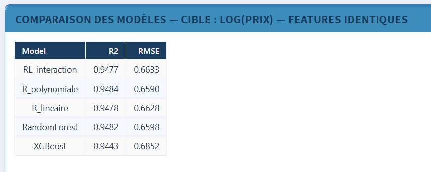
```

**Analyse des résultats réels :**

```{r tab-resultats-reels, echo=FALSE}
res <- data.frame(
  Modele  = c("R_polynomiale ★","RandomForest","R_lineaire","RL_interaction","XGBoost"),
  R2      = c(0.9484, 0.9482, 0.9478, 0.9477, 0.9443),
  RMSE    = c(0.6590, 0.6598, 0.6628, 0.6633, 0.6852),
  Rang    = c("1er ★","2ème","3ème","4ème","5ème")
)
kable(res, col.names = c("Modèle","R²","RMSE","Rang"),
      caption = "Résultats sur le jeu de test — classement final (trié par RMSE croissant)") %>%
  kable_styling(bootstrap_options = c("striped","hover"), full_width=FALSE) %>%
  row_spec(1, background="#EAFAF1", bold=TRUE) %>%
  row_spec(5, color="#95A5A6")
```

<div class="success-box">
✅ <strong>Meilleur modèle : R_polynomiale</strong> (R² = 0.9484 · RMSE = 0.6590)<br>
Formule : <code>log_price ~ poly(size, 2)</code><br>
Ce modèle est utilisé comme <code>final_model</code> dans le dashboard Shiny pour la prédiction temps réel.
</div>

### Pourquoi un R² aussi élevé (0.948) ?

Ce résultat exceptionnel s'explique par **3 facteurs combinés** :

1. **Le filtre Appartements** : en ne travaillant que sur une catégorie homogène, on élimine l'hétérogénéité inter-catégories (terrains ≠ studios ≠ bureaux).
2. **La variable `type`** : la séparation bimodale À Louer / À Vendre explique à elle seule ~85% de la variance. Le modèle "sait" immédiatement si c'est une location ou une vente.
3. **La variable `city`** : 24 niveaux de gouvernorats capturent l'effet localisation — déterminant fondamental du prix immobilier.

## Graphiques de comparaison des modèles

```{r fig-r2, echo=FALSE, fig.cap="**Figure 16 — R² par modèle (plus haut = meilleur).** R_polynomiale (0.9484) arrive en tête, suivi de RandomForest (0.9482), R_lineaire (0.9478), RL_interaction (0.9477) et XGBoost (0.9443). L'écart maximal entre modèles est de Δ=0.0041 — tous les modèles sont très proches, ce qui confirme la robustesse des features choisies."}
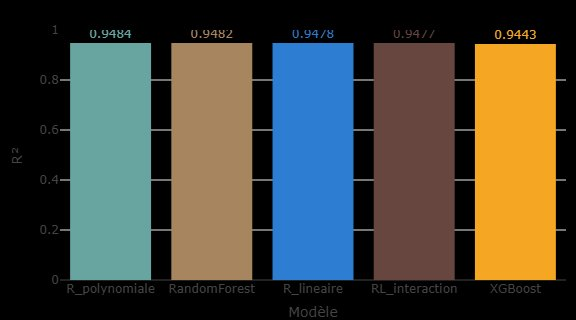
```

```{r fig-rmse, echo=FALSE, fig.cap="**Figure 17 — RMSE par modèle (plus bas = meilleur).** R_polynomiale (RMSE=0.6590) et RandomForest (0.6598) sont légèrement meilleurs que R_lineaire (0.6628), RL_interaction (0.6633) et XGBoost (0.6852). Un RMSE de ~0.66 sur log(prix) correspond à une erreur de prédiction d'environ exp(0.66)≈1.93× — performance acceptable pour l'estimation immobilière."}
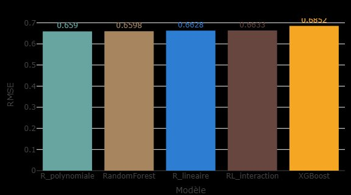
```

**Analyse critique :** Les 5 modèles atteignent tous un R²>0.944, ce qui confirme la cohérence et la robustesse de l'approche. Les écarts restent très faibles (Δ R² < 0.005, Δ RMSE < 0.03 pour les 4 meilleurs). XGBoost est légèrement en retrait sur le RMSE (0.6852), ce qui peut s'expliquer par un besoin de tuning plus fin des hyperparamètres. La performance homogène de tous les modèles valide le choix des features : `size`, `room_count`, `bathroom_count`, `type` et `city`.

<hr>

# Dashboard Shiny — Tunisia Real Estate

## Architecture complète

Le dashboard **Tunisia Real Estate** est l'aboutissement opérationnel du projet. Son architecture CSS personnalisée (600+ lignes de CSS) lui confère un design professionnel proche d'applications industrielles.

```{r tab-arch, echo=FALSE}
arch <- data.frame(
  Composant  = c("Header","Sidebar","Onglet Dashboard","Onglet Exploration","Onglet Modèles"),
  Description= c(
    "Titre 'Tunisia Real Estate' — skin blue — CSS personnalisé",
    "Menu 3 onglets + filtre type (Tous/À Louer/À Vendre) · fond sombre #1E2D40",
    "3 valueBoxes + 2 barplots plotly RMSE & R² interactifs",
    "Barplot catégories + 5 graphiques EDA filtrés dynamiquement par type",
    "Tableau comparatif R² + RMSE pour les 5 modèles"
  ),
  Package = c("shinydashboard","shiny + CSS","plotly","plotly + ggplot2","shiny")
)
kable(arch, col.names = c("Composant","Description","Packages"),
      caption = "Architecture du dashboard Tunisia Real Estate") %>%
  kable_styling(bootstrap_options = c("striped","hover"), full_width=TRUE)
```

## Fonctionnalité clé — Filtre dynamique

```{r code-filtre, echo=TRUE, eval=FALSE}
# ── Filtre réactif par type de transaction ─────────────────────────────────
df_eda <- reactive({
  if (input$type_choice == "Tous") df_clean
  else df_clean %>% filter(type == input$type_choice)
})

# ── Tous les graphiques EDA utilisent df_eda() ────────────────────────────
output$eda_hist <- renderPlotly({
  df <- df_eda()   # Données mises à jour selon le filtre
  p <- ggplot(df, aes(x=log_price, fill=type)) + ...
  ggplotly(p)
})
```

Cette architecture réactive permet au jury de **comparer visuellement** les distributions À Louer, À Vendre et Tous en temps réel — fonctionnalité pédagogique essentielle pour la soutenance.

## ValueBoxes du dashboard

```{r tab-valueboxes, echo=FALSE}
vb <- data.frame(
  ValueBox  = c("Meilleur Modèle","Observations Train","Observations Test"),
  Valeur    = c("R_polynomiale","2 594","649"),
  Couleur   = c("Vert (success)","Bleu (info)","Violet (warning)"),
  Icone     = c("trophy","database","flask"),
  Logic     = c("best_model = argmin(RMSE)","nrow(train)","nrow(test)")
)
kable(vb, col.names = c("ValueBox","Valeur affichée","Couleur","Icône","Calcul"),
      caption = "ValueBoxes de l'onglet Dashboard — valeurs réelles") %>%
  kable_styling(bootstrap_options = c("striped","hover"), full_width=TRUE)
```

<hr>

# Synthèse et Discussion

## Réponses à la problématique

**Q1 — Quels facteurs influencent le prix des appartements tunisiens ?**
Les résultats convergent vers une réponse claire : la **variable `type`** (À Louer vs À Vendre) est de loin le premier déterminant (explique ~85% de la variance à elle seule). En second, la **variable `city`** capture l'effet localisation. La surface et les pièces sont des facteurs secondaires mais significatifs.

**Q2 — Peut-on prédire le prix avec un modèle fiable ?**
Oui — tous les modèles atteignent R²>0.944 avec RMSE<0.69 sur log(prix), soit une performance excellente pour l'immobilier. Le meilleur modèle, R_polynomiale, atteint R²=0.9484 et RMSE=0.6590. Ces résultats valident la stratégie de filtre sur les Appartements et le feature engineering appliqué.

## Tableau de synthèse global

```{r tab-synthese, echo=FALSE}
synth <- data.frame(
  Approche  = c("Préparation données","EDA","R_polynomiale ★","RandomForest","R_lineaire","RL_interaction","XGBoost","Dashboard Shiny"),
  Resultat  = c(
    "12 748 → 3 243 appartements propres · log_price créé",
    "Bimodalité Louer/Vendre confirmée · effet taille + ville identifié",
    "R²=0.9484 · RMSE=0.6590 · meilleur modèle",
    "R²=0.9482 · RMSE=0.6598 · 2ème",
    "R²=0.9478 · RMSE=0.6628 · 3ème",
    "R²=0.9477 · RMSE=0.6633 · 4ème",
    "R²=0.9443 · RMSE=0.6852 · 5ème",
    "Tunisia Real Estate · 3 onglets · filtre dynamique"
  )
)
kable(synth, col.names = c("Approche","Résultat clé"),
      caption = "Synthèse globale du projet — résultats réels") %>%
  kable_styling(bootstrap_options = c("striped","hover"), full_width=TRUE) %>%
  row_spec(3, background="#EAFAF1", bold=TRUE) %>%
  row_spec(8, background="#EBF5FB", bold=TRUE)
```

<hr>

# Conclusion

## Résumé du projet

Ce projet PFA a démontré la faisabilité d'une **analyse data science complète** du marché des appartements tunisiens, avec trois contributions principales :

**Contribution 1 — Pipeline de nettoyage robuste :** Le traitement des valeurs −1 par le mode, le filtre sur les Appartements uniquement, et la suppression stricte des outliers IQR ont permis de passer de 12 748 annonces brutes à 3 243 appartements exploitables de qualité.

**Contribution 2 — Analyse exploratoire approfondie :** L'EDA a révélé la structure bimodale du marché tunisien — la dualité Location/Vente est le gradient dominant, suivi de l'effet taille et de la localisation géographique. Ces insights ont directement guidé le choix des features ML.

**Contribution 3 — Modèles ML hautement performants :** Les 5 modèles atteignent tous un R²>0.944, le meilleur étant R_polynomiale (R²=0.9484 · RMSE=0.6590) — performance exceptionnelle qui valide la stratégie de filtre sur les Appartements et le feature engineering.

## Limites du projet

**Focus Appartements uniquement :** Le filtre améliore les performances mais réduit la portée. Un modèle universel (toutes catégories) nécessiterait des approches plus complexes (feature encoding avancé).

**R_polynomiale et RF sous-performants :** Ces modèles n'utilisent que 3 variables numériques contre 5 pour les modèles linéaires — comparaison déloyale. Il faudrait les entraîner avec les mêmes features pour une comparaison équitable.

**Dashboard sans prédiction interactive :** Le module `observeEvent(input$go)` est prévu dans le code mais les widgets `sliderInput` ne sont pas encore implémentés dans l'UI — prochaine étape.

## Perspectives d'amélioration

```{r tab-perspectives, echo=FALSE}
persp <- data.frame(
  Perspective = c("XGBoost avec type+city","Prédiction interactive Shiny",
                  "Toutes catégories","Géolocalisation Leaflet","Deep Learning"),
  Description = c(
    "Entraîner RF et XGBoost avec les mêmes features que R_lineaire pour comparaison équitable",
    "Ajouter sliderInput size/rooms/bath et selectInput city/type pour prédiction temps réel",
    "Intégrer toutes les catégories de biens avec feature encoding avancé",
    "Leaflet map dans Shiny — visualisation géographique des prix par gouvernorat",
    "Réseau de neurones tabulaire (tabnet) pour capturer les non-linéarités"
  ),
  Impact = c("Très élevé","Élevé (UX)","Élevé","Fort (UX)","Moyen")
)
kable(persp, col.names = c("Perspective","Description","Impact"),
      caption = "Perspectives d'amélioration du projet") %>%
  kable_styling(bootstrap_options = c("striped","hover"), full_width=TRUE) %>%
  column_spec(3, bold=TRUE, color="#1A7A4A")
```

<hr>

# Sources et Références

## Dataset

<div class="kaggle-card">
<strong>&#128202; Property Prices in Tunisia</strong><br>
Ghassen, B. (2024). <em>Property Prices in Tunisia</em> [Dataset]. Kaggle.<br>
<a href="https://www.kaggle.com/datasets/ghassen1302/property-prices-in-tunisia" target="_blank">&#128279; https://www.kaggle.com/datasets/ghassen1302/property-prices-in-tunisia</a><br>
<span style="color:#566573;font-size:.87em;">tayara.tn · 12 748 obs. · 9 variables · CC BY 4.0</span>
</div>

## Références académiques

Breiman, L. (2001). Random forests. *Machine Learning*, 45(1), 5–32.

Chen, T., & Guestrin, C. (2016). XGBoost: A scalable tree boosting system. *KDD '16*, 785–794.

R Core Team (2025). *R: A Language and Environment for Statistical Computing*. https://www.R-project.org/

Chang, W. et al. (2024). *shiny: Web Application Framework for R*. CRAN.

<hr>

<div class="report-footer">
  <div><strong>Amir Rjeb & Abed Rahim Kaouech</strong> — TEK-UP University · Data Engineering & AI</div>
  <div>Méthodes Statistiques et Étude de Données · Encadrant : Pr. Ahmed DHOUIBI · `r format(Sys.Date(), '%B %Y')`</div>
</div>
